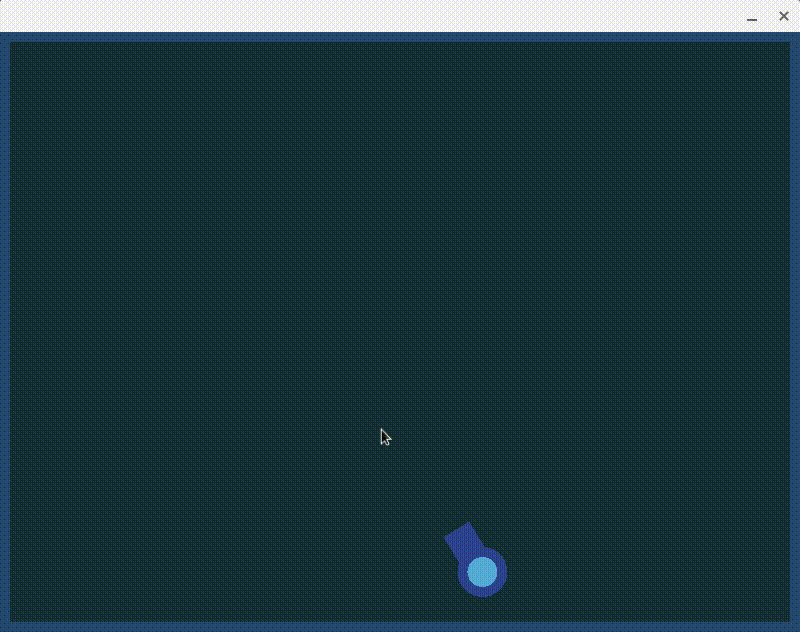

# Ball Bounce Physics v0.5

Ball Bounce Physics for the game I'm working on at the moment.

## Screenshots



## Build Floppy Square
* VSCode
    1. [Install Raylib](https://github.com/raysan5/raylib/wiki)
    2. Open Floppy Square in [VSCode](https://code.visualstudio.com/)
    3. Run "build debug/release" task
* Command line
    1. [Install Raylib](https://github.com/raysan5/raylib/wiki)
    2. Run
        ```
        make RAYLIB_PATH=/path/to/raylib OBJS=src/*.cpp

        # For debug mode
        make RAYLIB_PATH=/path/to/raylib OBJS=src/*.cpp BUILD_MODE=DEBUG
    
        # If you are using Shared library type
        make RAYLIB_PATH=/path/to/raylib OBJS=src/*.cpp RAYLIB_LIBTYPE=SHARED
        ```

Output is in the project folder.
